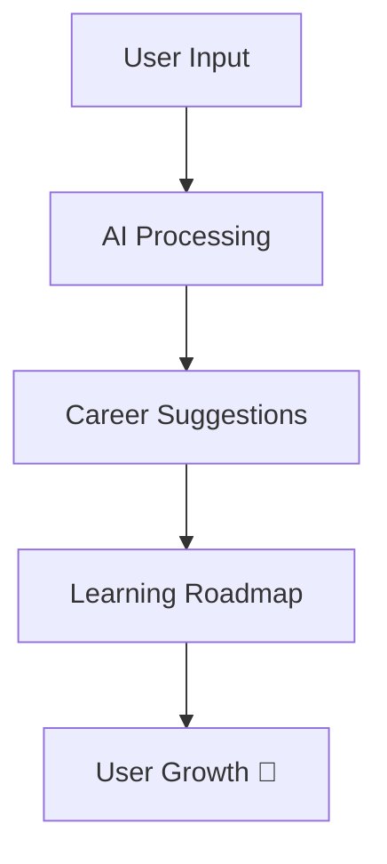

# 🚀 AI Career Guide  
### *Your Intelligent Career Discovery Partner*

  
  


---

## 🌟 Overview

**AI Career Guide** is a modern, AI-powered platform that helps users discover the best career paths based on their **skills, interests, and goals**.

> 💡 Built for hackathons, portfolios, and real-world impact.

---

## ✨ Key Features

- 🤖 AI-powered career recommendations  
- 🎯 Personalized career roadmap  
- 📚 Curated learning resources  
- ⚡ Fast, responsive UI  
- 🌙 Dark premium design (glassmorphism)  

---

## 🧠 How It Works



---

## 🛠️ Tech Stack

| Category   | Technology |
|------------|-----------|
| Frontend   | React.js |
| Backend    | Node.js / Express |
| AI         | OpenAI API |
| Styling    | Tailwind CSS |
| Deployment | Vercel / Netlify |

---

## 📸 Screenshots

Add your UI screenshots here

---

## ⚙️ Installation

```bash
git clone https://github.com/NayanaBhagat28/AI-Career-Guide.git
cd AI-Career-Guide
npm install
npm run dev
```

---

## 🚀 Future Scope

- 🤖 AI Mentor Chatbot  
- 📄 Resume Analyzer  
- 📊 Career Progress Dashboard  
- 🌐 Multi-language Support  

---

## 🏆 Why This Project Stands Out

✔ Real-world problem solving  
✔ AI integration  
✔ Clean UI/UX  
✔ Scalable architecture  

---

## 🤝 Contributing

Contributions are welcome!  
Feel free to fork, improve, and submit a PR 🚀

---

## 📜 License

MIT License  

---

## 💙 Author

**Nayana Bhagath**  
GitHub: https://github.com/NayanaBhagat28  

---

## ⭐ Support

If you like this project:

👉 Star the repo  
👉 Share with others  
👉 Give feedback  

---

## 🚀 Final Step

```bash
git add README.md
git commit -m "Added README"
git push
```
